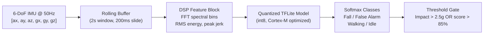
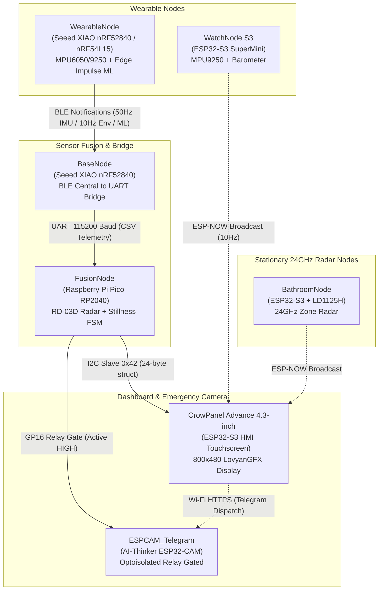
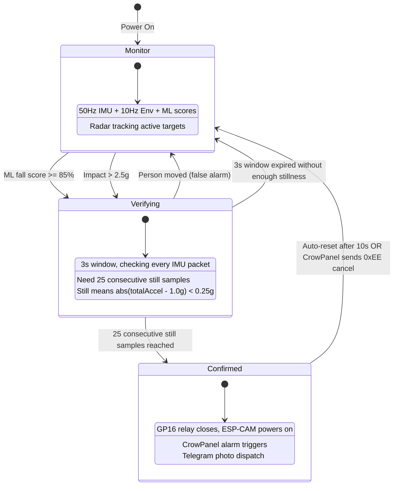

# RANGER  Multi-Node Fall Detection System 

[](https://opensource.org/licenses/MIT)
[](#wearable-platform-nordic-nrf54l15)
[](#core-system-nodes)
[](#machine-learning--tinyml-inference-pipeline)
[](#system-architecture)

---

## TL;DR

- **Two ways to catch a fall**: A wearable IMU on the body detects impact + orientation change, while a separate 24GHz FMCW radar watches from across the room. Both have to agree before triggering an alarm, which kills most false positives.
- **Nordic BLE wearables**: Built around **nRF52840** and testing on **nRF54L15** (Cortex-M33). BLE means the wearable runs for weeks on a small battery instead of hours on Wi-Fi.
- **ML runs on the MCU itself**: An Edge Impulse TinyML model runs inference at 50Hz directly on the wearable. It classifies falls vs. sitting down vs. walking without needing a server.
- **Three-check confirmation**: Impact spike (>2.5g) or ML confidence (>85%), then 3 seconds of stillness, then radar cross-check. Only after all three does it actually trigger.
- **Camera stays completely off until needed**: The ESP32-CAM sits behind an optocoupler relay. It has no power at all until a confirmed fall closes the gate. Then it wakes, snaps a photo, and pushes it to Telegram.

---

## Machine Learning & TinyML Inference Pipeline

The wearable runs an Edge Impulse TinyML model directly on the nRF52840's Cortex-M4F. No server, no cloud, no phone needed. The model was trained on recorded IMU data from real falls, intentional high-g movements (jumping, sitting down hard, running), normal walking, and idle postures.



### How the inference actually works

The wearable samples the MPU6050 at 50Hz (±8g accel, ±500 dps gyro). Every 200ms, it pushes the latest 6 readings into a rolling buffer of `EI_CLASSIFIER_DSP_INPUT_FRAME_SIZE` floats. Once the buffer is full (2 seconds of data), Edge Impulse's DSP block extracts features:

1. **Total acceleration magnitude**: $\|\vec{a}\| = \sqrt{a_x^2 + a_y^2 + a_z^2}$. This decouples impact detection from how the sensor is oriented on the body. During freefall this drops toward 0g, during impact it spikes to 2.5-6g.
2. **Jerk (rate of acceleration change)**: $J = \frac{d\|\vec{a}\|}{dt}$. A fall has a sharp, asymmetric jerk profile: slow onset (freefall) then violent deceleration (ground hit). Sitting down hard has a more symmetric profile.
3. **FFT spectral bins**: Walking produces strong periodic peaks around 1-2Hz. A tumble produces broadband chaotic energy across many frequency bins. This is probably the single most useful feature for separating falls from daily activities.
4. **Angular velocity magnitude**: $\|\vec{\omega}\| = \sqrt{\omega_x^2 + \omega_y^2 + \omega_z^2}$. Real falls tend to produce >120 deg/s of rotation. Sitting down produces almost none.

The classifier outputs four softmax scores (0-100%) for `Fall`, `False Alarm`, `Walking`, and `Idle`. These get packed into an 8-byte BLE characteristic and streamed to the base station.

### Training data collection

The [`tools/EI_DataCollector/`](tools/EI_DataCollector/) sketch turns the wearable into a CSV logger. You strap it on, run `capture.sh`, and record labeled sessions: fall forward, fall backward, fall sideways, sit down fast, jump, walk, stand still. The CSVs go straight into Edge Impulse Studio for training. More diverse training data = fewer false positives in practice.

---

## Wearable Platform: Nordic nRF54L15

Wi-Fi eats too much power for something you wear all day, so the wearable side runs on **Nordic Semiconductor** BLE chips:

- **nRF52840 (current)**: Cortex-M4F @ 64MHz, 1MB Flash, 256KB RAM, BLE 5.3. This is what the wearable and base station run on right now.
- **nRF54L15 (testing - see [`NRF54_Test/`](NRF54_Test/))**:
  - Cortex-M33 @ 128MHz with better DSP instructions, so ML inference runs faster at lower power.
  - BLE 5.4 support including direction finding (AoA), which could eventually give room-level positioning.
  - Sub-microamp sleep current - realistic coin-cell battery life for months.

---

## System Architecture



---

## Core System Nodes

### Production Nodes ([`nodes/`](nodes/) & [`NRF54_Test/`](NRF54_Test/))

| Node | Target Hardware | Primary Sensors / Roles | Transports & Interfaces |
|---|---|---|---|
| [**WearableNode**](nodes/WearableNode/) | Seeed XIAO nRF52840 | MPU6050 6-DoF IMU, BMP280, Edge Impulse ML Engine | BLE Peripheral (Notify @ 50Hz) |
| [**NRF54_Test**](NRF54_Test/) | Seeed XIAO nRF54L15 | Cortex-M33 bring-up and I2C scanner for testing new hardware | USB-CDC, Fast-Mode I2C (400kHz), BLE 5.4 |
| [**BaseNode**](nodes/BaseNode/) | Seeed XIAO nRF52840 | Dedicated BLE Central receiver & UART bridge | BLE Central &rarr; UART (115200 baud) |
| [**FusionNode**](nodes/FusionNode/) | Raspberry Pi Pico (RP2040) | Fall FSM brain, RD-03D 24GHz mmWave radar, relay power gate | UART (256k & 115k), I2C Slave (`0x42`) |
| [**CrowPanel**](nodes/CrowPanel/) | CrowPanel Advance 4.3" (ESP32-S3) | ST7265 800x480 IPS display, GT911 touch, TCA9534 expander | I2C Master, ESP-NOW, Wi-Fi Station |
| [**WatchNode_S3**](nodes/WatchNode_S3/) | ESP32-S3 SuperMini | MPU9250 9-DoF IMU, BMP280 Barometer, WS2812B NeoPixel | Connectionless ESP-NOW (10Hz) |
| [**BathroomNode**](nodes/BathroomNode/) | ESP32-S3 SuperMini | HLK-LD1125H 24GHz radar zone presence and fall tracking | ESP-NOW Broadcast |
| [**ESPCAM_Telegram**](nodes/ESPCAM_Telegram/) | AI-Thinker ESP32-CAM | OV2640 / GC2145 image sensor, optoisolated power switch | Wi-Fi HTTPS to Telegram Bot API |

### Legacy Generation 2 System ([`legacy_ranger2/`](legacy_ranger2/))

- [**Ranger_Base_Station**](legacy_ranger2/Ranger_Base_Station/): ESP32-S3 Base Station with 320x240 ILI9341 SPI TFT, SIM800C GSM modem, and RD-03D radar.
- [**SensorNode_WiFi**](legacy_ranger2/SensorNode_WiFi/): ESP32-C6 Wi-Fi TCP wearable node streaming newline-delimited JSON.
- [**ShowNode_Auxiliary**](legacy_ranger2/ShowNode_Auxiliary/): Deneyap 1A v2 (ESP32-S3) demonstration node with SSD1306 OLED, DHT11, and radar.

### Utilities & Tools ([`tools/`](tools/))

- [**EI_DataCollector**](tools/EI_DataCollector/): Streamlined Arduino IMU CSV logger with automated `capture.sh` script for training Edge Impulse models.
- [**RadarOverlay**](tools/RadarOverlay/): Canvas-based real-time 2D radar point-cloud visualizer.

---

## 24GHz FMCW Radar Subsystem

The stationary radar nodes (RD-03D on the FusionNode, HLK-LD1125H on the BathroomNode) operate in the 24.00-24.25 GHz ISM band. They transmit a linear frequency chirp and measure the beat frequency of the reflected return to extract target range, and the Doppler shift to extract target radial velocity.

### How FMCW range detection works

The transmitter sweeps from $f_0$ to $f_0 + B$ over a chirp period $T_c$:

$$f(t) = f_0 + \frac{B}{T_c} \cdot t$$

When the signal bounces off a person and comes back, it arrives delayed by $\tau = 2R/c$. The receiver mixes the returned signal with the current transmit signal, producing a beat frequency $f_b$ proportional to the target's distance:

$$R = \frac{c \cdot T_c \cdot f_b}{2B}$$

With $B = 250\text{ MHz}$ bandwidth, the range resolution is:

$$\Delta R = \frac{c}{2B} = \frac{3 \times 10^8}{2 \times 250 \times 10^6} = 0.60\text{ m}$$

So the radar can distinguish two targets that are at least 60cm apart. Good enough for a room.

### Doppler velocity extraction

If the target is moving toward or away from the antenna, the reflected signal gets frequency-shifted:

$$f_d = \frac{2 v_r f_0}{c}$$

At 24GHz ($\lambda = 1.25\text{ cm}$), a person falling at $v_r = 1.5\text{ m/s}$ produces a Doppler shift of 240Hz. That is easy to detect and very distinctive. Normal walking produces maybe 40-80Hz. Standing still produces nothing.

### RD-03D frame protocol

The RD-03D streams binary frames at 256000 baud over UART. Each frame tracks up to 3 simultaneous targets:

- Header: `0xAA 0xFF 0x03 0x00`
- 3x 8-byte target blocks (X position, Y position, radial speed, resolution in mm)
- Footer: `0x55 0xCC`

Positions and speeds use a sign-magnitude encoding where the MSB of the high byte indicates sign (`1` = positive, `0` = negative). The firmware also filters out frozen frames (where the radar keeps repeating identical data) and speed sentinel values (248 and 256 cm/s) that the RD-03D outputs when it has no valid speed reading.

---

## Fall Verification State Machine

The fall detection logic runs on the FusionNode (RP2040). It is deliberately conservative: the whole point is to avoid false alarms while still catching real emergencies.



### The three stages in detail

**Stage 1: Trigger.** Either the ML classifier on the wearable reports fall confidence >= 85%, or the raw acceleration vector $\|\vec{a}\|$ exceeds 2.5g. Either one is enough to enter the verification window. There is also a 30-second cooldown (`FALL_COOLDOWN_MS`) after a confirmed fall to prevent re-triggering while the person is being helped up.

**Stage 2: Stillness verification.** Once triggered, the FSM opens a 3-second window and starts counting consecutive IMU samples where the person is not moving. "Not moving" means `abs(totalAccel - 1.0g) < 0.25g`. The counter needs to reach 25 consecutive samples. If the person moves during the window, the counter does not just reset to zero: it decrements by 3 for each moving sample (`stillnessCount = max(0, stillnessCount - 3)`). This hysteresis prevents a single noisy sample from resetting progress, but sustained movement will drain it fast. If the 3-second window expires without reaching 25, the whole thing resets to monitoring.

**Stage 3: Confirmed fall.** If stillness is confirmed, `fallDetected` goes to 2. The relay on GP16 goes HIGH, which closes the optocoupler gate and delivers power to the ESP32-CAM. The CrowPanel gets the updated `fallState=2` on its next I2C read and triggers audio/visual alarms. The ESP-CAM boots, connects to Wi-Fi, takes a photo, and POSTs it to the Telegram Bot API. The relay stays on for 60 seconds, then cuts power again.

---

## Inter-Node Communication

The system uses four different transports depending on what makes sense for each link:

### BLE (Wearable to Base Station)

The wearable runs as a BLE peripheral with three notify characteristics under service UUID `833d1814-...`:

| Characteristic | Rate | Size | Contents |
|---|---|---|---|
| IMU (`...2a01`) | 50Hz | 20 bytes | 6x `int16_t` accel+gyro (raw), 3x `int16_t` mag, `uint16_t` sequence |
| Environmental (`...2a02`) | 10Hz | 15 bytes | `int32_t` pressure (Pa), `uint32_t` IR + Red PPG, `uint8_t` status (battery + SOS), `uint16_t` sequence |
| ML Result (`...2a04`) | on inference | 8 bytes | 4x class scores, winner index, confidence, flags, sequence |

Accel values are raw register reads from the MPU6050 at ±8g range (divide by 4096 for g-force). Gyro is ±500 dps range (divide by 65.5 for degrees/second).

### UART (Base Station to FusionNode)

The base station decodes BLE packets and re-encodes them as ASCII CSV lines at 115200 baud:

```
I,<ax>,<ay>,<az>,<gx>,<gy>,<gz>,<seq>
E,<pressure_pa>,<ir>,<red>,<battery>,<sos>,<seq>
M,<fall%>,<false_alarm%>,<idle%>,<walk%>,<winner_idx>,<confidence%>,<flags>
STAT,BASE_LINK_OK
STAT,W_LOST
```

CSV over UART is simple, debuggable (you can just hook up a serial monitor), and the RP2040 has no BLE stack to deal with.

### I2C Slave (FusionNode to CrowPanel)

The FusionNode exposes a 24-byte packed struct on I2C address `0x42`. The CrowPanel polls this every loop iteration:

```cpp
struct TelemetryPacket {     // 24 bytes total
    uint8_t  magic;          // Always 0xAA
    int16_t  ax, ay, az;     // Accel (raw, /4096 for g)
    int16_t  gx, gy, gz;     // Gyro (raw, /65.5 for dps)
    uint8_t  battery;        // 0-100%
    uint8_t  sos;            // 0 or 1
    uint8_t  fallState;      // 0=normal, 1=verifying, 2=confirmed
    uint8_t  wearLink;       // 0=offline, 1=connected
    uint8_t  radarPresent;   // 0=clear, 1=target tracked
    int16_t  radarDist_mm;   // Target distance in mm
    int16_t  radarSpeed;     // Target velocity in cm/s
    uint8_t  radarTargets;   // 0-3 active targets
    uint8_t  checksum;       // XOR of bytes 0..22
};
```

The struct is double-buffered so the I2C ISR always reads a consistent snapshot. The CrowPanel can also write `0xEE` to cancel a confirmed fall alarm.

### ESP-NOW (WatchNode, BathroomNode to CrowPanel)

Connectionless broadcast at 10Hz. No pairing, no handshake. The CrowPanel just listens. This is used for secondary nodes that do not need the full BLE-to-UART pipeline.

---

## Project Roadmap & TODO

- [ ] **Port ML model to nRF54L15**: Get Edge Impulse inference and CMSIS-NN kernels running on the Cortex-M33.
- [ ] **BLE direction finding**: Use AoA to figure out which room the wearable is in.
- [ ] **Barometric fall detection**: Use BMP388 altitude drops ($\Delta h > 0.8\text{m}$ in $< 500\text{ms}$) as another ML feature.
- [ ] **Wake-on-motion sleep**: Use IMU `WOM` interrupt so the Nordic chip stays in deep sleep until actual movement happens.
- [ ] **More training data**: Record more real-world stumbles, slips, and edge cases for Edge Impulse.
- [ ] **Encrypted BLE**: Add AES-128 pairing between wearable and base station.

---

## Directory Structure

- [`docs/`](docs/) - Technical specifications and theoretical foundations:
  - [`ARCHITECTURE.md`](docs/ARCHITECTURE.md) - System topology, bus specifications, and packet byte maps
  - [`PHYSICS_THEORY.md`](docs/PHYSICS_THEORY.md) - Kinematics, FMCW radar Doppler equations, and RF link budget
  - [`PINOUT_GUIDE.md`](docs/PINOUT_GUIDE.md) - Full pinout and wiring tables across all boards
- [`nodes/`](nodes/) - Source code for active production nodes
- [`NRF54_Test/`](NRF54_Test/) - Hardware bring-up and I2C probing for the nRF54L15
- [`legacy_ranger2/`](legacy_ranger2/) - Generation 2 reference code and prototype modules
- [`tools/`](tools/) - Dataset acquisition scripts and radar visualization tools

---

## Getting Started & Flashing Instructions

### Required Arduino Board Packages

- **Nordic nRF52:** `Seeed nRF52 Boards` (v1.1.8+) or `Adafruit nRF52`
- **Nordic nRF54:** `Seeed nRF54 Boards` / Zephyr RTOS toolchain
- **Raspberry Pi Pico:** `Raspberry Pi Pico/RP2040` by Earle F. Philhower, III
- **ESP32 Core:** `esp32` by Espressif Systems (v2.0.14+ or v3.0+)

### Required Libraries

- `LovyanGFX` (for CrowPanel ST7265 RGB parallel display)
- `TCA9534` (for CrowPanel port expander)
- `DFRobotDFPlayerMini` (for audio synthesizer on Fusion Node)
- `Adafruit NeoPixel` (for RGB LED indicators)
- `Adafruit GFX` & `Adafruit ILI9341` / `Adafruit SSD1306` (for legacy nodes)

---

## Configuration & Credentials

Before flashing network-connected nodes ([`CrowPanel.ino`](nodes/CrowPanel/CrowPanel.ino), [`ESPCAM_Telegram.ino`](nodes/ESPCAM_Telegram/ESPCAM_Telegram.ino), and [`Ranger.ino`](legacy_ranger2/Ranger_Base_Station/Ranger.ino)), configure your network credentials in each respective file:

```cpp
#define WIFI_SSID           "YOUR_WIFI_SSID"
#define WIFI_PASS           "YOUR_WIFI_PASSWORD"
#define TELEGRAM_BOT_TOKEN  "YOUR_TELEGRAM_BOT_TOKEN"
#define TELEGRAM_CHAT_ID    "YOUR_TELEGRAM_CHAT_ID"
```

---

## Technical Documentation

- [System Architecture & Data Format Specification](docs/ARCHITECTURE.md)
- [Physics & RF Link Budget Theory](docs/PHYSICS_THEORY.md)
- [Hardware Wiring & Pinout Guide](docs/PINOUT_GUIDE.md)

---

## License

This project is licensed under the MIT License - see the repository root for details.
