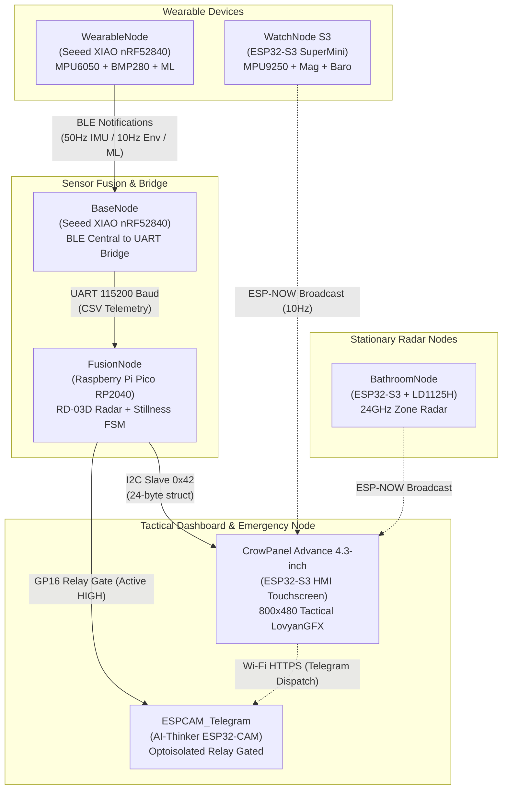
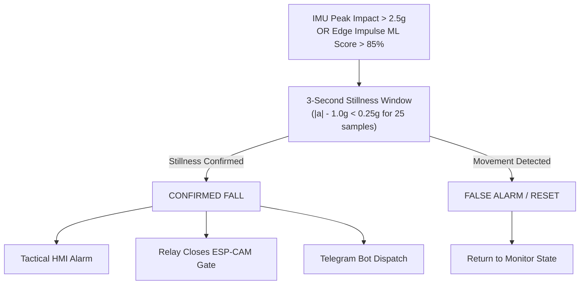

# RANGER — Multi-Node Sensor Fusion Fall Detection & Tactical Monitoring System

[](https://opensource.org/licenses/MIT)
[](#core-system-nodes)
[](https://www.arduino.cc/)
[](#crowpanel-compilation-settings-esp32-s3)

**RANGER** is a multi-node, multi-frequency fall detection and real-time biometric monitoring ecosystem. By combining high-rate wearable kinematic modeling (IMU + Machine Learning) with stationary 24GHz FMCW mmWave radar tracking, RANGER resolves the classic trade-off between sensitivity and false alarm rejection.

---

## System Architecture



---

## Core System Nodes

### Production Nodes ([`nodes/`](nodes/))

| Node | Target Hardware | Primary Sensors / Roles | Transports & Interfaces |
|---|---|---|---|
| [**WearableNode**](nodes/WearableNode/) | Seeed XIAO nRF52840 | MPU6050 6-DoF IMU, BMP280, Edge Impulse ML Engine | BLE Peripheral (Notify @ 50Hz) |
| [**BaseNode**](nodes/BaseNode/) | Seeed XIAO nRF52840 | Dedicated BLE Central receiver & UART bridge | BLE Central &rarr; UART (115200 baud) |
| [**FusionNode**](nodes/FusionNode/) | Raspberry Pi Pico (RP2040) | Fall FSM brain, RD-03D 24GHz mmWave radar, relay power gate | UART (256k & 115k), I2C Slave (`0x42`) |
| [**CrowPanel**](nodes/CrowPanel/) | CrowPanel Advance 4.3" (ESP32-S3) | ST7265 800x480 IPS display, GT911 touch, TCA9534 expander | I2C Master, ESP-NOW, Wi-Fi Station |
| [**WatchNode_S3**](nodes/WatchNode_S3/) | ESP32-S3 SuperMini | MPU9250 9-DoF IMU, BMP280 Barometer, WS2812B NeoPixel | Connectionless ESP-NOW (10Hz) |
| [**BathroomNode**](nodes/BathroomNode/) | ESP32-S3 SuperMini | HLK-LD1125H 24GHz radar zone presence and fall tracking | ESP-NOW Broadcast |
| [**ESPCAM_Telegram**](nodes/ESPCAM_Telegram/) | AI-Thinker ESP32-CAM | OV2640 / GC2145 image sensor, optoisolated power switch | Wi-Fi HTTPS to Telegram Bot API |

### Legacy Generation 2 System ([`legacy_ranger2/`](legacy_ranger2/))

- [**Ranger_Base_Station**](legacy_ranger2/Ranger_Base_Station/): ESP32-S3 Base Station with 320x240 ILI9341 SPI TFT, SIM800C GSM modem, and RD-03D radar.
- [**SensorNode_WiFi**](legacy_ranger2/SensorNode_WiFi/): ESP32-C6 Wi-Fi TCP wearable node streaming newline-delimited JSON.
- [**ShowNode_Auxiliary**](legacy_ranger2/ShowNode_Auxiliary/): Deneyap 1A v2 (ESP32-S3) demonstration node with SSD1306 OLED, DHT11, and radar.

### Utilities & Tools ([`tools/`](tools/))

- [**EI_DataCollector**](tools/EI_DataCollector/): Streamlined Arduino IMU CSV logger with automated `capture.sh` script for training Edge Impulse models.
- [**RadarOverlay**](tools/RadarOverlay/): Canvas-based real-time 2D radar point-cloud visualizer.

---

## Fall Verification Logic



---

## Directory Structure

- [`docs/`](docs/) — Complete technical, architectural, and mathematical documentation:
  - [`ARCHITECTURE.md`](docs/ARCHITECTURE.md) — System topology, bus specifications, and packet byte maps
  - [`PHYSICS_THEORY.md`](docs/PHYSICS_THEORY.md) — Kinematics, FMCW radar Doppler equations, and RF link budget
  - [`PINOUT_GUIDE.md`](docs/PINOUT_GUIDE.md) — Full pinout and wiring tables across all boards
- [`nodes/`](nodes/) — Source code for active production nodes
- [`legacy_ranger2/`](legacy_ranger2/) — Generation 2 reference code and prototype modules
- [`tools/`](tools/) — Dataset acquisition scripts and radar visualization tools

---

## Getting Started & Flashing Instructions

### Required Arduino Board Packages

- **ESP32 Core:** `esp32` by Espressif Systems (v2.0.14+ or v3.0+)
- **Raspberry Pi Pico:** `Raspberry Pi Pico/RP2040` by Earle F. Philhower, III
- **Seeed nRF52:** `Seeed nRF52 Boards` (v1.1.8+)

### Required Libraries

- `LovyanGFX` (for CrowPanel ST7265 RGB parallel display)
- `TCA9534` (for CrowPanel port expander)
- `DFRobotDFPlayerMini` (for audio synthesizer on Fusion Node)
- `Adafruit NeoPixel` (for RGB LED indicators)
- `Adafruit GFX` & `Adafruit ILI9341` / `Adafruit SSD1306` (for legacy nodes)

### CrowPanel Compilation Settings (ESP32-S3)

When compiling [`CrowPanel.ino`](nodes/CrowPanel/CrowPanel.ino) in Arduino IDE:

- **Board:** `ESP32S3 Dev Module`
- **PSRAM:** `OPI PSRAM` (*CRITICAL — required for LovyanGFX sprite framebuffers*)
- **Flash Mode:** `QIO 80MHz`
- **Flash Size:** `16MB (128Mb)`
- **Partition Scheme:** `Huge APP (3MB No OTA / 1MB SPIFFS)`

---

## Configuration & Credentials

Before flashing network-connected nodes ([`CrowPanel.ino`](nodes/CrowPanel/CrowPanel.ino), [`ESPCAM_Telegram.ino`](nodes/ESPCAM_Telegram/ESPCAM_Telegram.ino), and [`Ranger.ino`](legacy_ranger2/Ranger_Base_Station/Ranger.ino)), configure your network credentials in each respective file:

```cpp
#define WIFI_SSID           "YOUR_WIFI_SSID"
#define WIFI_PASS           "YOUR_WIFI_PASSWORD"
#define TELEGRAM_BOT_TOKEN  "YOUR_TELEGRAM_BOT_TOKEN"
#define TELEGRAM_CHAT_ID    "YOUR_TELEGRAM_CHAT_ID"
```

---

## Technical Documentation

- [System Architecture & Data Format Specification](docs/ARCHITECTURE.md)
- [Physics & RF Link Budget Theory](docs/PHYSICS_THEORY.md)
- [Hardware Wiring & Pinout Guide](docs/PINOUT_GUIDE.md)

---

## License

This project is licensed under the MIT License — see the repository root for details.
