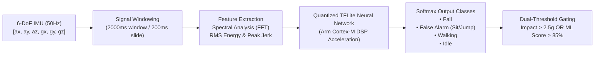
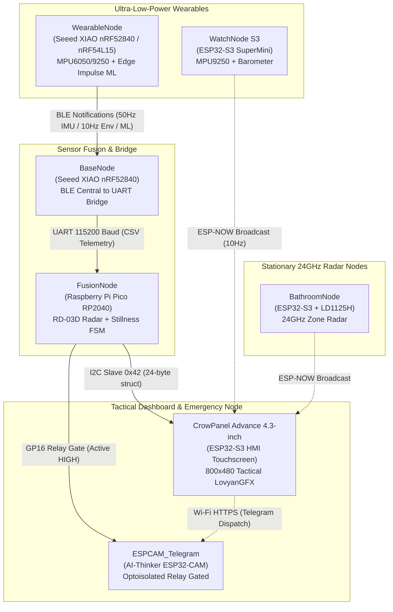
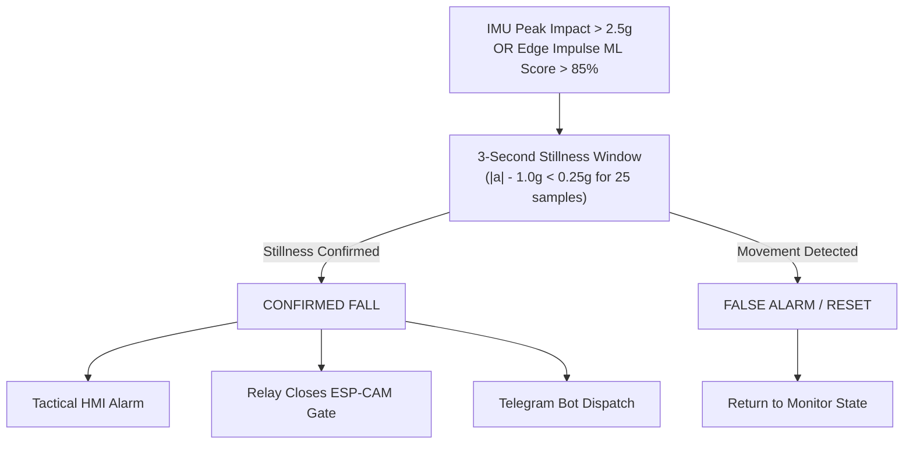

# RANGER — Multi-Node Sensor Fusion Fall Detection & Tactical Monitoring System

[](https://opensource.org/licenses/MIT)
[](#next-generation-wearable-nordic-nrf54l15-migration)
[](#core-system-nodes)
[](#machine-learning--tinyml-inference-pipeline)
[](#system-architecture)

---

## TL;DR

- **Dual-Modality Architecture**: Combines ultra-low-power body-worn kinematics (IMU + on-device Machine Learning) with stationary 24GHz FMCW mmWave radar tracking to eliminate false alarms.
- **Nordic-Centric Wearable Platform**: Built on **Nordic Semiconductor nRF52840** and next-generation **nRF54L15** (Arm Cortex-M33 @ 128MHz with BLE 5.4), prioritizing sub-milliamp battery consumption, deterministic low-latency transmission, and edge DSP over power-hungry Wi-Fi alternatives.
- **On-Device Edge ML**: Runs quantized TinyML neural network inference at 50Hz directly on the microcontroller to distinguish actual falls from sports, sudden sitting, or bed drops.
- **Multi-Stage Physical Verification**: A fall is only confirmed if an impact impulse (>2.5g) or high ML confidence (>85%) is followed by continuous post-impact stillness (3 seconds) and validated against room-level radar Doppler shifts.
- **Privacy-Preserving Emergency Capture**: The emergency camera node remains completely unpowered behind an optocoupler relay until a confirmed fall closes the gate, immediately dispatching snapshot frames to a Telegram bot.

---

## Machine Learning & TinyML Inference Pipeline

The wearable node executes an on-device Edge Impulse machine learning model optimized for Arm Cortex-M DSP instructions.



### Feature Engineering & Input Processing
1. **Kinematic Windowing**: High-rate continuous sampling of tri-axial acceleration ($a_x, a_y, a_z$) and angular rate ($g_x, g_y, g_z$) at **50 Hz** in 2.0-second overlapping time windows.
2. **Frequency & Time-Domain DSP**:
   - **Total Acceleration Vector**: $\|\vec{a}\| = \sqrt{a_x^2 + a_y^2 + a_z^2}$ to decouple body orientation from impact detection.
   - **Jerk Rate**: $\frac{d\|\vec{a}\|}{dt}$ to capture the rapid deceleration characteristic of ground impact.
   - **Spectral Power Density**: Fast Fourier Transform (FFT) frequency bin analysis to isolate chaotic tumble dynamics from periodic gait signatures.
3. **Classification Classes**:
   - `Fall`: Uncontrolled descent followed by high-g impact and rapid orientation collapse.
   - `False Alarm`: High-acceleration intentional activities (jumping, sitting down quickly, running).
   - `Walking`: Periodic rhythmic gait dynamics.
   - `Idle`: Static sitting, standing, or gentle posture shifts.

---

## Next-Generation Wearable: Nordic nRF54L15 Migration

While legacy systems often rely on power-hungry Wi-Fi microcontrollers, RANGER centers on **Nordic Semiconductor** for wearable endpoints:

- **nRF52840 (Active Production)**: Arm Cortex-M4F @ 64MHz, 1MB Flash, 256KB RAM, native Bluetooth 5.3 Low Energy.
- **nRF54L15 (Next-Gen Target & [`NRF54_Test/`](NRF54_Test/))**:
  - **Arm Cortex-M33 @ 128MHz** with TrustZone and enhanced DSP instructions for faster TinyML inference at lower energy per inferencing cycle.
  - **Bluetooth 5.4 Ready**: Support for Periodic Advertising with Responses (PAwR) and Angle of Arrival (AoA) direction finding.
  - **Ultra-Low Power**: Sub-microamp sleep currents with ultra-fast cold start, enabling months of continuous wear on a small coin-cell or compact LiPo battery.

---

## System Architecture



---

## Core System Nodes

### Production Nodes ([`nodes/`](nodes/) & [`NRF54_Test/`](NRF54_Test/))

| Node | Target Hardware | Primary Sensors / Roles | Transports & Interfaces |
|---|---|---|---|
| [**WearableNode**](nodes/WearableNode/) | Seeed XIAO nRF52840 | MPU6050 6-DoF IMU, BMP280, Edge Impulse ML Engine | BLE Peripheral (Notify @ 50Hz) |
| [**NRF54_Test**](NRF54_Test/) | Seeed XIAO nRF54L15 | Next-Gen Arm Cortex-M33 test platform, I2C scanner & diagnostics | USB-CDC, Fast-Mode I2C (400kHz), BLE 5.4 |
| [**BaseNode**](nodes/BaseNode/) | Seeed XIAO nRF52840 | Dedicated BLE Central receiver & UART bridge | BLE Central &rarr; UART (115200 baud) |
| [**FusionNode**](nodes/FusionNode/) | Raspberry Pi Pico (RP2040) | Fall FSM brain, RD-03D 24GHz mmWave radar, relay power gate | UART (256k & 115k), I2C Slave (`0x42`) |
| [**CrowPanel**](nodes/CrowPanel/) | CrowPanel Advance 4.3" (ESP32-S3) | ST7265 800x480 IPS display, GT911 touch, TCA9534 expander | I2C Master, ESP-NOW, Wi-Fi Station |
| [**WatchNode_S3**](nodes/WatchNode_S3/) | ESP32-S3 SuperMini | MPU9250 9-DoF IMU, BMP280 Barometer, WS2812B NeoPixel | Connectionless ESP-NOW (10Hz) |
| [**BathroomNode**](nodes/BathroomNode/) | ESP32-S3 SuperMini | HLK-LD1125H 24GHz radar zone presence and fall tracking | ESP-NOW Broadcast |
| [**ESPCAM_Telegram**](nodes/ESPCAM_Telegram/) | AI-Thinker ESP32-CAM | OV2640 / GC2145 image sensor, optoisolated power switch | Wi-Fi HTTPS to Telegram Bot API |

### Legacy Generation 2 System ([`legacy_ranger2/`](legacy_ranger2/))

- [**Ranger_Base_Station**](legacy_ranger2/Ranger_Base_Station/): ESP32-S3 Base Station with 320x240 ILI9341 SPI TFT, SIM800C GSM modem, and RD-03D radar.
- [**SensorNode_WiFi**](legacy_ranger2/SensorNode_WiFi/): ESP32-C6 Wi-Fi TCP wearable node streaming newline-delimited JSON.
- [**ShowNode_Auxiliary**](legacy_ranger2/ShowNode_Auxiliary/): Deneyap 1A v2 (ESP32-S3) demonstration node with SSD1306 OLED, DHT11, and radar.

### Utilities & Tools ([`tools/`](tools/))

- [**EI_DataCollector**](tools/EI_DataCollector/): Streamlined Arduino IMU CSV logger with automated `capture.sh` script for training Edge Impulse models.
- [**RadarOverlay**](tools/RadarOverlay/): Canvas-based real-time 2D radar point-cloud visualizer.

---

## Fall Verification Logic



---

## Project Roadmap & TODO

- [ ] **nRF54L15 TinyML Port**: Port full Edge Impulse inference model and CMSIS-NN kernels to the Seeed XIAO nRF54L15 (Arm Cortex-M33).
- [ ] **BLE 5.4 Direction Finding**: Implement Angle of Arrival (AoA) packet tags for room-level wearable localization.
- [ ] **Barometric Fall Signatures**: Integrate BMP388 high-precision altitude delta ($\Delta h > 0.8\text{m}$ in $< 500\text{ms}$) into the ML feature vector.
- [ ] **Dynamic Power Profiling**: Enable IMU threshold wake-up interrupts (`WOM` - Wake On Motion) to keep the Nordic core in sub-microamp System OFF sleep until motion occurs.
- [ ] **Expanded ML Training Corpus**: Expand Edge Impulse dataset with diverse real-world stumbles, slip-and-fall scenarios, and age-varied kinematics.
- [ ] **Encrypted BLE Channel**: Implement AES-128 BLE pairing and secure telemetry encapsulation between wearable and base station.

---

## Directory Structure

- [`docs/`](docs/) — Technical specifications and theoretical foundations:
  - [`ARCHITECTURE.md`](docs/ARCHITECTURE.md) — System topology, bus specifications, and packet byte maps
  - [`PHYSICS_THEORY.md`](docs/PHYSICS_THEORY.md) — Kinematics, FMCW radar Doppler equations, and RF link budget
  - [`PINOUT_GUIDE.md`](docs/PINOUT_GUIDE.md) — Full pinout and wiring tables across all boards
- [`nodes/`](nodes/) — Source code for active production nodes
- [`NRF54_Test/`](NRF54_Test/) — Hardware verification and I2C probing for next-gen Nordic nRF54L15
- [`legacy_ranger2/`](legacy_ranger2/) — Generation 2 reference code and prototype modules
- [`tools/`](tools/) — Dataset acquisition scripts and radar visualization tools

---

## Getting Started & Flashing Instructions

### Required Arduino Board Packages

- **Nordic nRF52:** `Seeed nRF52 Boards` (v1.1.8+) or `Adafruit nRF52`
- **Nordic nRF54:** `Seeed nRF54 Boards` / Zephyr RTOS toolchain
- **Raspberry Pi Pico:** `Raspberry Pi Pico/RP2040` by Earle F. Philhower, III
- **ESP32 Core:** `esp32` by Espressif Systems (v2.0.14+ or v3.0+)

### Required Libraries

- `LovyanGFX` (for CrowPanel ST7265 RGB parallel display)
- `TCA9534` (for CrowPanel port expander)
- `DFRobotDFPlayerMini` (for audio synthesizer on Fusion Node)
- `Adafruit NeoPixel` (for RGB LED indicators)
- `Adafruit GFX` & `Adafruit ILI9341` / `Adafruit SSD1306` (for legacy nodes)

---

## Configuration & Credentials

Before flashing network-connected nodes ([`CrowPanel.ino`](nodes/CrowPanel/CrowPanel.ino), [`ESPCAM_Telegram.ino`](nodes/ESPCAM_Telegram/ESPCAM_Telegram.ino), and [`Ranger.ino`](legacy_ranger2/Ranger_Base_Station/Ranger.ino)), configure your network credentials in each respective file:

```cpp
#define WIFI_SSID           "YOUR_WIFI_SSID"
#define WIFI_PASS           "YOUR_WIFI_PASSWORD"
#define TELEGRAM_BOT_TOKEN  "YOUR_TELEGRAM_BOT_TOKEN"
#define TELEGRAM_CHAT_ID    "YOUR_TELEGRAM_CHAT_ID"
```

---

## Technical Documentation

- [System Architecture & Data Format Specification](docs/ARCHITECTURE.md)
- [Physics & RF Link Budget Theory](docs/PHYSICS_THEORY.md)
- [Hardware Wiring & Pinout Guide](docs/PINOUT_GUIDE.md)

---

## License

This project is licensed under the MIT License — see the repository root for details.
