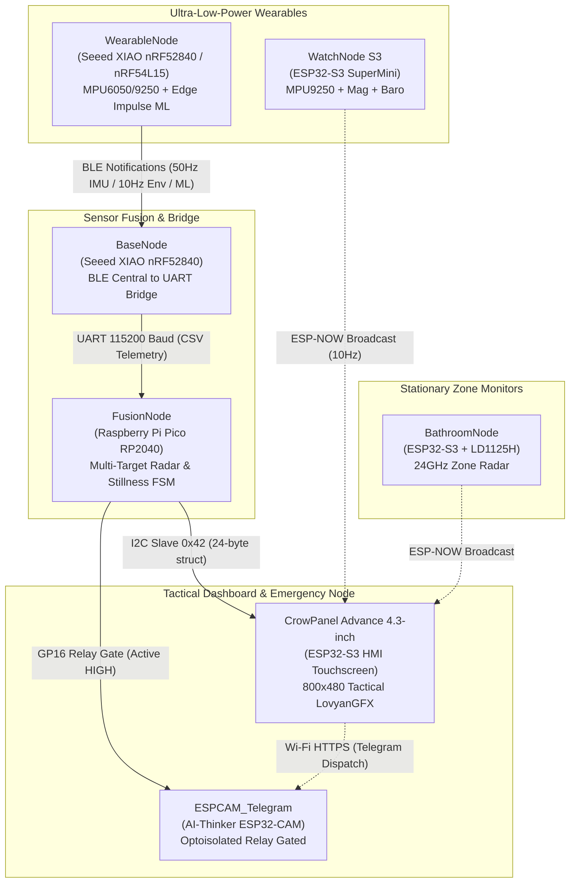
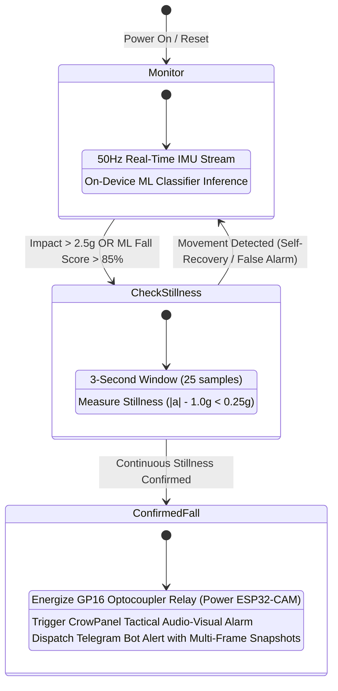

# RANGER Architecture & Protocol Specification

This document details the system topology, inter-node communication protocols, packet byte layouts, and the multi-stage fall verification state machine.

---

## System Topology & Flow



---

## Communication Protocols

### 1. BLE Characteristic Specification (WearableNode &rarr; BaseNode)

- **Service UUID:** `833d1814-9988-4e31-8db2-2c67699cd1c1`

#### IMU Characteristic (`...2a01`) — 20 Bytes @ 50 Hz

| Byte Range | Field | Data Type | Scaling / Representation |
|---|---|---|---|
| `[0..5]` | Accelerometer ($a_x, a_y, a_z$) | `int16_t` (Big-Endian) | Divide by $4096 \text{ LSB/g}$ |
| `[6..11]` | Gyroscope ($g_x, g_y, g_z$) | `int16_t` (Big-Endian) | Divide by $65.5 \text{ LSB/dps}$ |
| `[12..17]` | Magnetometer ($m_x, m_y, m_z$) | `int16_t` (Big-Endian) | Raw magnetic flux density |
| `[18..19]` | Sequence Counter | `uint16_t` (Big-Endian) | Monotonically increasing packet ID |

#### Environmental Characteristic (`...2a02`) — 15 Bytes @ 10 Hz

| Byte Range | Field | Data Type | Scaling / Description |
|---|---|---|---|
| `[0..3]` | Barometric Pressure | `int32_t` (Big-Endian) | Pressure in Pascals ($\text{Pa}$) |
| `[4..7]` | Photoplethysmography IR | `uint32_t` (Big-Endian) | MAX30102 Infrared ADC Count |
| `[8..11]` | Photoplethysmography Red | `uint32_t` (Big-Endian) | MAX30102 Red ADC Count |
| `[12]` | Status Byte | `uint8_t` | Bit 7: SOS state (`1`=Active), Bits 0..6: Battery % (`0..100`) |
| `[13..14]` | Sequence Counter | `uint16_t` (Big-Endian) | Monotonically increasing packet ID |

#### Machine Learning Classifier Characteristic (`...2a04`) — 8 Bytes

| Byte Index | Field | Range / Description |
|---|---|---|
| `[0]` | Fall Score | `0 – 100%` Confidence |
| `[1]` | False Alarm Score | `0 – 100%` Confidence |
| `[2]` | Idle Score | `0 – 100%` Confidence |
| `[3]` | Walking Score | `0 – 100%` Confidence |
| `[4]` | Winner Class Index | `0`: Fall, `1`: False Alarm, `2`: Idle, `3`: Walking |
| `[5]` | Prediction Confidence | Overall model certainty percentage |
| `[6]` | Status Flags | Bit 0 = SOS State |
| `[7]` | Sequence Counter | Monotonic sequence byte |

---

### 2. BaseNode &rarr; FusionNode UART Frame Format (115200 Baud)

The BaseNode decodes incoming BLE packets and forwards ASCII CSV telemetry strings over Hardware UART (`Serial1`):

- **Kinematics Line:** `I,<ax>,<ay>,<az>,<gx>,<gy>,<gz>,<seq>\n`
- **Environmental Line:** `E,<pressure_pa>,<ir>,<red>,<battery>,<sos>,<seq>\n`
- **Machine Learning Line:** `M,<fall%>,<false_alarm%>,<idle%>,<walk%>,<winner_idx>,<confidence%>,<flags>\n`
- **System Status Events:** `STAT,BASE_BOOT`, `STAT,BASE_LINK_OK`, `STAT,W_OK`, `STAT,W_LOST`, `STAT,LINK_LOST`

---

### 3. FusionNode &rarr; CrowPanel I2C Slave Specification (Address 0x42)

The Fusion Node acts as an I2C slave responder (`Wire1`, address `0x42`), returning a packed **24-byte telemetry structure** with a 1-byte XOR checksum on every read request from the CrowPanel master.

```cpp
struct TelemetryPacket {
    uint8_t  magic;         // 0xAA preamble
    int16_t  ax, ay, az;    // Raw acceleration (divide by 4096 -> g)
    int16_t  gx, gy, gz;    // Raw angular velocity (divide by 65.5 -> dps)
    uint8_t  battery;       // 0–100%
    uint8_t  sos;           // 0 or 1
    uint8_t  fallState;     // 0 = Normal, 1 = Verifying, 2 = Confirmed Fall
    uint8_t  wearLink;      // 0 = Offline, 1 = Connected
    uint8_t  radarPresent;  // 0 = Clear, 1 = Target Tracked
    int16_t  radarDist_mm;  // Target Distance in millimeters
    int16_t  radarSpeed;    // Target Velocity in cm/s
    uint8_t  radarTargets;  // Active Target Count (0–3)
    uint8_t  checksum;      // XOR checksum of bytes 0..22
};
```

---

### 4. RD-03D 24GHz mmWave Radar Interface (256000 Baud)

- **Frame Header:** `0xAA 0xFF 0x03 0x00`
- **Frame Footer:** `0x55 0xCC`
- **Target Payload Block:** 8 bytes per target (supports up to 3 simultaneous targets):
  - Bytes `0..1`: X position (sign-magnitude mm)
  - Bytes `2..3`: Y position (sign-magnitude mm)
  - Bytes `4..5`: Radial speed (sign-magnitude cm/s)
  - Bytes `6..7`: Spatial resolution (mm)

**Sign-Magnitude Value Decoding:**
```cpp
int16_t val = ((high & 0x7F) << 8) | low;
if ((high & 0x80) == 0) {
    val = -val;
}
```

---

## Fall Verification State Machine


